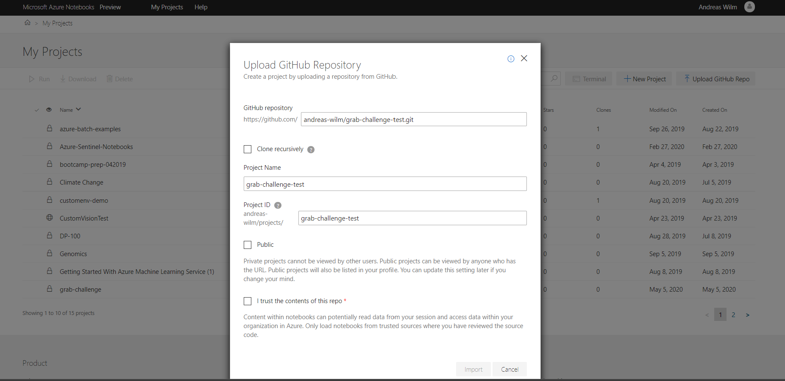
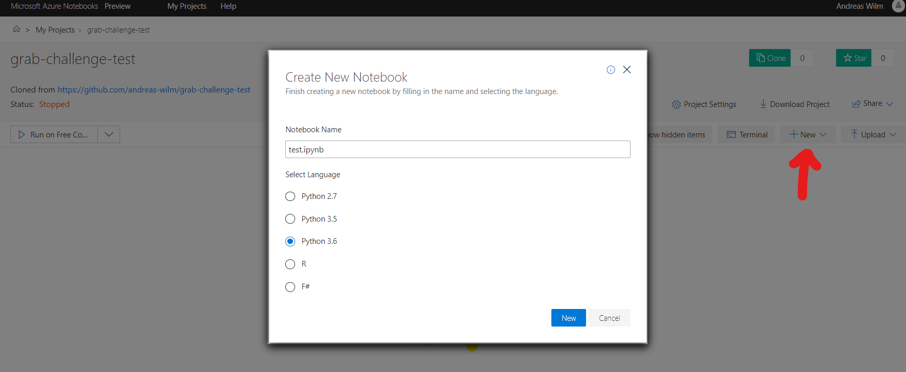
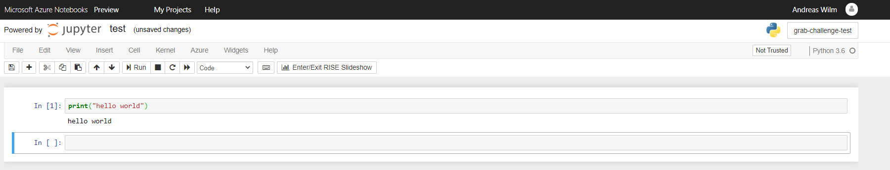

# Getting started with Azure Notebooks and Github

Jupyter Notebooks are very popular in Data Science. They allow you to explore the data and write some code in your web browser, without having to install software locally. [Azure Notebooks]() is a free and Microsoft hosted Jupyter Notebook service. There are many other and more specialised services (reach out to us to discuss alternatives, like the [DSVM](https://docs.microsoft.com/en-us/azure/machine-learning/data-science-virtual-machine/overview) in your [Azure for Students account](https://azure.microsoft.com/en-us/free/students/)), but Azure Notebooks is one of the easier ways to get started.

To track code changes over time we will use [Git & Github](https://github.com/), which will also allow you to easily change systems later if needed. 

## Step-by-step instructions on how to get started with a Git tracked Azure Notebook:

Go to Github and [create a new repository](https://help.github.com/en/enterprise/2.14/user/articles/creating-a-new-repository). If you don’t already have an account, you might have to create a free Github account first. The newly created repository will be empty at first. In a later step we will add the Jupyter Notebooks to it. For now, copy the repo’s URL for subsequent steps. The URL will look similar to https://github.com/user/reponame.git.

Next, go to [Azure Notebooks](https://notebooks.azure.com/) and click on "Sign In" (top right). You will be asked for a Microsoft account. No worries, if you don’t have one. You can simply use your gmail address for example, by linking it to a Microsoft account. A wizard will guide you through this process. Once signed in, go to "My Projects". Quickly familiarize yourself with the [My Projects dashboard](https://docs.microsoft.com/en-us/azure/notebooks/create-clone-jupyter-notebooks#use-the-my-projects-dashboard).

Then, import your empty Github project, by using the copied Github URL, as described [here](https://docs.microsoft.com/en-us/azure/notebooks/create-clone-jupyter-notebooks#import-a-project-from-github). See the screenshot below for an example. 

By importing the Github repository, a new project will be created for you. 

Next, create a new notebook (New/Notebook). Choose Python for now 

Click on the newly created Notebook to start it and write some code in the first cell, e.g.

    print("hello world")

and press shift+enter or click on Run. You should see the string "hello world" appear.

 

Hit the save icon (top left) to save the notebook. See the Azure Notebooks tutorial or this introduction for more on Notebooks and consider having a look at the Notebook samples at a later stage.

While this downloading step is easily done through the web interface, the Git uploading requires some work in the terminal. If you are new to Git, we recommend to go through this introduction before proceeding.

First, we need to configure git: On your Azure Notebooks Project page, Click "Terminal". In the newly created shell, type (replacing "yourname" and "youremail"):

    cd library
    git config user.name yourname
    git config user.email youremail
    git config --global push.default simple

This completes the one time git setup for Notebooks.

By typing

    git status

you will see what files are not tracked by git and which already tracked files have been changed. In your case, the just created Notebook (*ipynb) will show up as untracked. To have git track it (and in the future, to add changes), use the following:

    git add test.ipynb
    git commit

A text editor (nano) will pop up. Write a commit message (e.g. “first commit”), type Ctrl+o and enter to save and Ctrl+x to save.
This commits your code changes to the Git history. To upload the changes, run:

    git push

Enter your Github name and password. Done.
Go to the Github repo to see your code changes appear there.

At a later stage you will need to install packages to your Notebook. See [this link](https://jakevdp.github.io/blog/2017/12/05/installing-python-packages-from-jupyter/) to read how to properly install packages to Jupyter Notebooks. Note that Azure Notebooks also has an [alternative way](https://docs.microsoft.com/en-us/azure/notebooks/quickstart-create-jupyter-notebook-project-environment) to install packages.

Reach out to us on the Teams channel for any questions!
